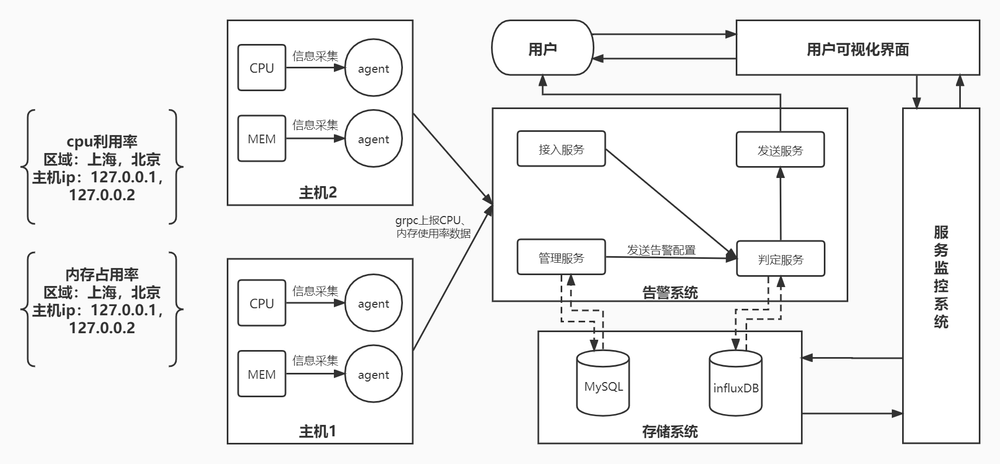

# tx_gdut_monitor

## 介绍
微型监控系统

## 基本功能
- [ ] 采集linux系统的**cpu使用率**、**内存使用率**并上报。**60s**的上报时间粒度 
- [ ] 通过**页面或者接口配置告警触发条件**
- [ ] 支持**聚合数据，固定0点开始聚合**，比如聚合5分钟的数据
    * 聚合的时候支持累加、求最大、求最小、求平均值
- [ ] **阈值告警**，告警支持三个等级，提示、严重、致命
- [ ] **服务Docker化**

## 系统架构

1. **信息采集端**
    * **信息采集agent**：负责采集系统的信息并上报给子系统
2. **告警子系统**
    * **告警管理服务**：支持配置告警的触发条件，并写入mysql，通过http接口或者页面（不强制）配置
    * **告警接入模块**：接收上报信息发送给判定模块
    * **告警判定模块**：支持处理上报的信息，将上报信息存储起来，并根据配置决定是否告警，也负责聚合数据
    * **告警发送服务**：支持将告警消息通知到各个平台，实现邮箱通知即可

## 拓展功能
1. 支持监控对象管理：
    * 实现监控对象的注册与发现
    * 支持存活性检测，可使用ping、telnet、http等方式
    * 支持灵活扩展采集agent，以支持更多数据的采集
2. 告警模块：
    * 告警介入模块对接收的归档信息进行分类归档后，再发送给告警判定模块
    * 页面按监控对象及指标等分类显示所有的实时告警信息，还可显示历史告警信息
    * 对满足一定等级的告警除了页面显示外，再采用邮件通知，可以同时给多个邮箱发送警告
    * 支持报警收敛，以防止警报消息太多（采用滚动收敛算法）
    * 支持日报
3. 提供页面视图：
    * 提供监控对象的存活性状态、指标视图
    * 提供系统配置的自定义视图的功能
    * 提供告警接收方管理
        * 自定义通知邮箱，并且可以配置多封邮箱
        * 设置邮箱可接收的报警等级信息，以支持不同的报警信息分发到不同的邮箱
4. 数据存储模块：使用Redis作为实时库，使用MySQL或influxDB作为历史库

## 目录结构
* configs：放配置文件
* docs：程序文档
* global：全局变量
* internal：内部模块，各个模块代码的具体实现源码放在这个文件夹下
    * dao：数据访问层
    * model：模型层
    * service：项目核心业务逻辑层
    * ……
* pkg：项目相关的模块包
* storage：项目生成的临时文件
* third_parity：第三方资源库
* ......