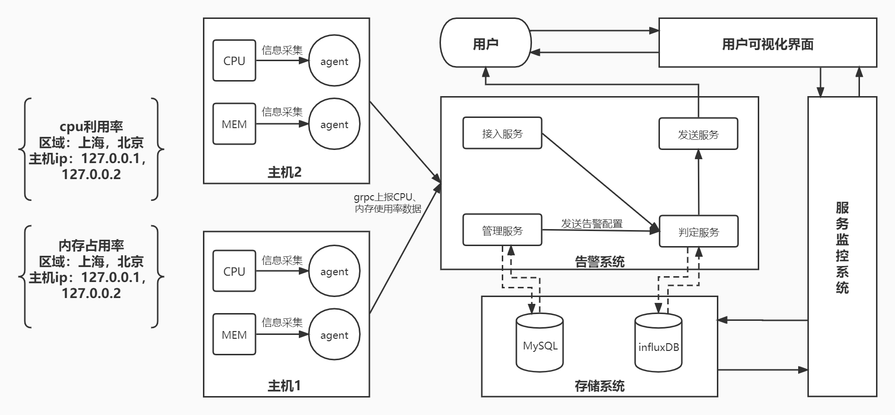
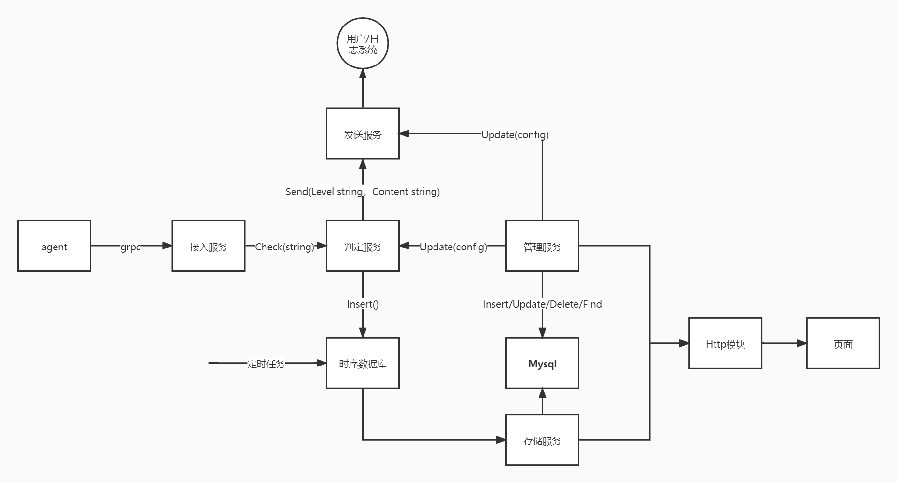

# tx_gdut_monitor

## 介绍
微型监控系统

## 基本功能
- [ ] 采集linux系统的**cpu使用率**、**内存使用率**并上报。**60s**的上报时间粒度 
- [ ] 通过**页面或者接口配置告警触发条件**
- [ ] 支持**聚合数据，固定0点开始聚合**，比如聚合5分钟的数据
    * 聚合的时候支持累加、求最大、求最小、求平均值
- [ ] **阈值告警**，告警支持三个等级，提示、严重、致命
- [ ] **服务Docker化**

## 系统架构

1. **信息采集端**
    * **信息采集agent**：负责采集系统的信息并上报给子系统
2. **告警子系统**
    * **告警管理服务**：支持配置告警的触发条件，并写入mysql，通过http接口或者页面（不强制）配置
    * **告警接入模块**：接收上报信息发送给判定模块
    * **告警判定模块**：支持处理上报的信息，将上报信息存储起来，并根据配置决定是否告警，也负责聚合数据
    * **告警发送服务**：支持将告警消息通知到各个平台，实现邮箱通知即可

## 拓展功能
1. 支持监控对象管理：
    * 实现监控对象的注册与发现
    * 支持存活性检测，可使用ping、telnet、http等方式
    * 支持灵活扩展采集agent，以支持更多数据的采集
2. 告警模块：
    * 告警介入模块对接收的归档信息进行分类归档后，再发送给告警判定模块
    * 页面按监控对象及指标等分类显示所有的实时告警信息，还可显示历史告警信息
    * 对满足一定等级的告警除了页面显示外，再采用邮件通知，可以同时给多个邮箱发送警告
    * 支持报警收敛，以防止警报消息太多（采用滚动收敛算法）
    * 支持日报
3. 提供页面视图：
    * 提供监控对象的存活性状态、指标视图
    * 提供系统配置的自定义视图的功能
    * 提供告警接收方管理
        * 自定义通知邮箱，并且可以配置多封邮箱
        * 设置邮箱可接收的报警等级信息，以支持不同的报警信息分发到不同的邮箱
4. 数据存储模块：使用influxDB存储时序数据，使用MySQL存储系统配置数据

## 目录结构
* monitor-agent：Agent采集系统
    * cmd：通常有一个小的 `main` 函数，从 `/internal` 和 `/pkg` 目录导入和调用代码。但不要在这个目录中放置太多代码。
    * configs：当前系统的配置文件模板或默认配置。
    * build：打包和持续集成。
    * scripts：当前系统执行各种构建、安装、分析等操作的脚本。
    * test：额外的外部测试应用程序和测试数据。
    * global：系统全局变量
    * internal：私有应用程序和库代码。即外部应用程序不可以使用的当前系统的库代码
    * pkg：外部应用程序可以使用的当前系统的代码
    * storage：系统生成的临时文件
    * third_parity：外部辅助工具，分叉代码和其他第三方工具
    * tools：系统的支持工具
    * ……
* monitor-alert：告警系统，目录结构参照`monitor-agent`
* monitor-manage：服务监控系统，目录结构参照`monitor-agent`
    * api：OpenAPI/Swagger 规范，JSON 模式文件，协议定义文件。
* monitor-web：可视化界面系统，目录结构参照`monitor-agent`
* monitor-storage: 存储系统，目录结构参照`monitor-agent`
    * configs
        * database：存放SQL脚本
* configs：项目全局公共配置文件
    * proto：存放所有的proto文件
    * ……
* wiki：项目部署文档
    * images：文档相关图片
* build: 项目的编译、构建相关文件

## 团队开发注意事项
1. 除了monitor-manage系统与monitor-web系统之间采用HTTP通信，其余所有系统之间采用grpc通信。
2. 系统与系统之间采用通信的方式共享数据，系统内部的服务之间采用Interface接口的方式共享数据。
3. 确保系统之间没有代码层面的依赖关系，即一个系统禁止import导入另一个系统的库代码。
4. 如果一个系统需要调用另一个系统的函数，则该函数应该在PB协议中定义。
5. 尽量确保每个系统都能独立部署、运行。
6. 之前上传的一些配置文件和数据库链接初始化示例已转存至monitor-manage文件夹下。
7. **使用git push自己的代码之前，注意编写好.gitignore文件，过滤掉无须上传的文件或文件夹，并且统一将代码push到develop分支**。